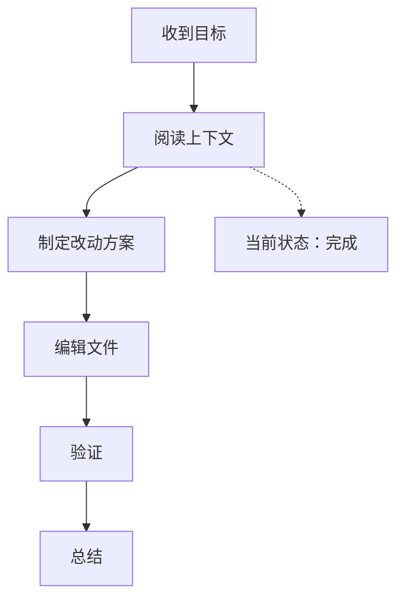

<!-- code-cctv:start -->
# Code CCTV

最后更新：2026-07-28 21:04:49 CST
状态：完成
当前关注：不同期刊分页已完成，屏幕预览、翻页控件、HTML/PDF 纸张和测试均已对齐

## 信息金字塔

| 优先级 | 先看什么 | 证据 / 下一步 |
| --- | --- | --- |
| P0 架构主线 | React 前端、FastAPI API、Jinja/PDF 渲染和 ArticleStore 构成四条协作链路 | 先确认入口和数据流，再判断风险 |
| P1 当前质量 | 前端构建、类型检查和 45 项 Python 测试已有验证基础 | 补齐模块级职责、边界和残余风险 |
| P2 清理边界 | 样本、模板、运行数据和独立 CLI 都有用途 | 只把有证据的死代码列为清理候选 |
| P0 数据安全 | 文章对象使用 pickle，当前是内部单机存储但不适合不可信数据 | 后续迁移结构化 JSON 或数据库字段 |
| P1 真实编辑器 | ArticleEditorPage.tsx 仍使用 CSS columnCount 自动高度布局 | 应与四个样例页统一显式双列实现并补浏览器回归 |
| P1 文档一致性 | README 的 web:dev、5174、42 项测试与当前实现不一致 | 修正文档命令和验证数量 |

## 模块图谱

| 模块 | 相关代码 | 职责 | 依赖 | 风险 | 怎么核对 |
| --- | --- | --- | --- | --- | --- |
| 启动与配置 | src/config.py;src/main.py;src/server.py | 区分开发/生产模式，启动 CLI 与 FastAPI | 环境变量、FastAPI、Vite | 双端口/单端口配置容易混淆 | 查看 README 启动命令并访问 /api/health |
| JATS 解析与领域模型 | src/parser/jats_parser.py | 把 XML 解析为 Article/Section/Figure/Table/Formula 等对象 | lxml、样本 XML | 标签兼容性和深层内容保真度 | 运行 tests/test_parser.py 并查看 Article 字段 |
| 存储与文章 API | src/store.py;src/server.py:117-1490 | 持久化元数据/文章，提供上传、编辑、预览、导出和图片访问 | SQLite、pickle、FastAPI | pickle 载荷和文件边界仍是长期风险 | 调用 /api/health、/api/articles、非法 ID 测试 |
| React 工作台 | web/src/main.tsx;web/src/app/routes.tsx;web/src/app/Root.tsx;web/src/app/PortalApp.tsx;web/src/app/ArticleEditorPage.tsx | 门户上传、真实文章编辑、样例期刊页面和共享壳层 | React Router、Vite、Shell | 样例编辑器与真实编辑器存在两套数据模型 | 访问 /、/studio/editor 和四个 /studio/* 路由 |

```mermaid
flowchart TD
    M0["模块：启动与配置"]
    M0 --> M0C["代码：src/config.py;src/main.py;src/server.py"]
    M0 --> M0R["职责：区分开发/生产模式，启动 CLI 与 FastAPI"]
    M0 --> M0V["核对：查看 README 启动命令并访问 /api/health"]
    M0 -.-> M0K["风险：双端口/单端口配置容易混淆"]
    M0 -.-> M0D0["依赖：环境变量"]
    M0 -.-> M0D1["依赖：FastAPI"]
    M0 -.-> M0D2["依赖：Vite"]
    M1["模块：JATS 解析与领域模型"]
    M1 --> M1C["代码：src/parser/jats_parser.py"]
    M1 --> M1R["职责：把 XML 解析为 Article/Section/Figure/Table/Formula 等对象"]
    M1 --> M1V["核对：运行 tests/test_parser.py 并查看 Article 字段"]
    M1 -.-> M1K["风险：标签兼容性和深层内容保真度"]
    M1 -.-> M1D0["依赖：lxml"]
    M1 -.-> M1D1["依赖：样本 XML"]
    M2["模块：存储与文章 API"]
    M2 --> M2C["代码：src/store.py;src/server.py:117-1490"]
    M2 --> M2R["职责：持久化元数据/文章，提供上传、编辑、预览、导出和图片访问"]
    M2 --> M2V["核对：调用 /api/health、/api/articles、非法 ID 测试"]
    M2 -.-> M2K["风险：pickle 载荷和文件边界仍是长期风险"]
    M2 -.-> M2D0["依赖：SQLite"]
    M2 -.-> M2D1["依赖：pickle"]
    M2 -.-> M2D2["依赖：FastAPI"]
    M3["模块：React 工作台"]
    M3 --> M3C["代码：web/src/main.tsx;web/src/app/routes.tsx;web/src/app/Root.tsx;web/..."]
    M3 --> M3R["职责：门户上传、真实文章编辑、样例期刊页面和共享壳层"]
    M3 --> M3V["核对：访问 /、/studio/editor 和四个 /studio/* 路由"]
    M3 -.-> M3K["风险：样例编辑器与真实编辑器存在两套数据模型"]
    M3 -.-> M3D0["依赖：React Router"]
    M3 -.-> M3D1["依赖：Vite"]
    M3 -.-> M3D2["依赖：Shell"]
```

## 流程图

## 实时记录

| 时间 | 阶段 | 发生了什么 | 证据 |
| --- | --- | --- | --- |
| 2026-07-28 19:40:31 CST | 开始 | 开始全项目架构分析，本轮不修改业务代码 | 用户要求解剖整体项目 |
| 2026-07-28 19:42:01 CST | 架构扫描 | 已生成 Python/TypeScript 函数定位骨架，正在阅读关键入口和数据模型 | scan_code_map.py 输出了 src 与 web/src 的函数/类位置 |
| 2026-07-28 19:43:26 CST | 发现问题 | 发现 README 的 web:dev/5174 与实际脚本和 Vite 5173 不一致；ArticleEditorPage 仍使用旧 columnCount 多栏实现，可能复现已修复的双栏问题 | README.md:58-70; web/vite.config.ts:8-17; package.json scripts; web/src/app/ArticleEditorPage.tsx:241 |
| 2026-07-28 19:47:32 CST | 开始复核 | 已读取项目监控规范，开始只读复核；工作区存在大量既有未提交改动，后续仅记录分析结论，不回滚用户改动 | git status 与项目文件清单 |
| 2026-07-28 20:19:15 CST | 需求变更 | 用户要求增加不同期刊的分页；将复用共享壳层与期刊预览，不再只改单个样例页 | 现有四个期刊页各自 Preview，真实编辑器独立 Preview，当前没有统一页面分页组件 |
| 2026-07-28 20:51:36 CST | 功能已接入 | 共享壳层新增分页状态与翻页按钮，四个样例和真实编辑器已传入期刊纸张预设；后端模板新增 page_size 参数 | 45 passed；typecheck/build 通过；浏览器四路分页与图片检查通过；API Letter 模板响应已核对 |
| 2026-07-28 21:04:49 CST | 完成 | 分页功能已交付；保留用户既有未提交改动，不做回滚或无关清理 | 45 passed；typecheck/build/compileall/diff-check 通过；浏览器四期刊无破图；Letter API 模板核对通过 |

## 涉及文件

| 文件 | 用途 | 状态 |
| --- | --- | --- |

## 函数定位

| 位置 | 函数 | 作用 | 怎么核对 |
| --- | --- | --- | --- |

## 代码片段说明

| 位置 | 代码片段 | 这段在做什么 | 初学者核对点 |
| --- | --- | --- | --- |

## 决策记录

| 决策 | 原因 | 取舍 |
| --- | --- | --- |
| 暂不修改业务代码 | 用户当前要求解剖整体项目，先输出证据和改造优先级 | 避免把分析请求扩大为未经确认的重构 |

## 验证结果

| 检查 | 结果 | 备注 |
| --- | --- | --- |

## 初学者核对清单

| 要核对什么 | 怎么核对 | 预期结果 |
| --- | --- | --- |

## 风险与待确认

- 暂无。

## 最终总结

已完成不同期刊的分页支持：共享壳层提供纸张预设、页数计算与上下页导航；Elsevier、Springer、Nature 默认 A4，IEEE 默认 Letter；真实编辑器可切换 A4/Letter，HTML/PDF 导出通过 page_size 参数保持一致。
<!-- code-cctv:end -->
