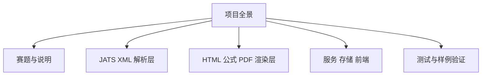
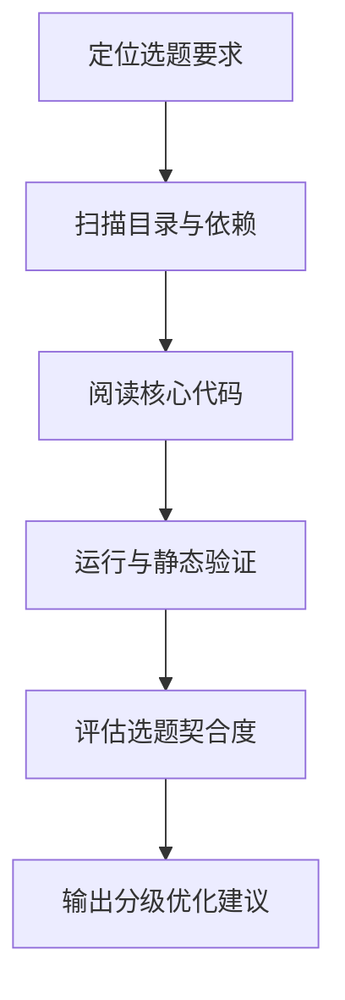

# Code CCTV

最后更新：2026-07-11 CST
状态：制定方案
当前关注：正在优化上传表单交互与 JATS 原始表格的 rowspan/colspan、多行表头和响应式排版。

## 信息金字塔

| 优先级 | 先看什么 | 证据 / 下一步 |
| --- | --- | --- |
| P0 | 先修正文树解析与资源链路 | 已复现章节错位、图题混入正文和 CLI PDF 破图；直接影响赛题需求 2/3 |
| P0 | 关闭 HTML 注入面 | Jinja 自动转义关闭，上传内容能形成真实 HTML 标签；Web 展示前必须安全转义/净化 |
| P1 | 用真实 JATS 提升泛化能力 | 5 个 PMC XML 都能解析，但 `pmc5684321.xml` 静默丢失 8 位作者和 43 条混合型参考文献 |
| P1 | 建立 PDF 回归基线 | 单/双栏可生成且公式清晰，但破图、摘要分页、三线表和 running header 尚未达标 |
| P1 | 修复构建与依赖 | 缺 `browse.html`；旧 mathjax-node 审计出 10 个漏洞，22 个公式处理约 3.6 秒 |
| P2 | 整理存储、API 与工程化 | 年份/图表统计错误、非法年份返回 500、重复数据、Black 未通过，需补 CI 与锁文件 |

## 模块图谱

| 模块 | 相关代码 | 职责 | 依赖 | 风险 | 怎么核对 |
| --- | --- | --- | --- | --- | --- |
| 赛题与说明 | 期刊赛题.docx、README.md、docs/ | 定义期刊 XML 处理目标、功能范围和验收方向 | Word 文档与项目说明 | 若实现偏离赛题，其他优化价值会下降 | 对照赛题逐项建立实现映射 |
| 解析层 | src/parser/ | 把 JATS XML 转换为内部文章数据 | XML 输入与数据模型 | 复杂标签、命名空间和异常输入可能漏处理 | 运行解析测试并检查真实样本 |
| 渲染层 | src/renderer/ | 输出 HTML、公式图片与 PDF | 解析结果、模板及外部渲染库 | 公式、分页、资源路径和中文字体是高风险点 | 对样例生成 HTML/PDF 并检查输出 |
| 服务与存储 | src/server.py、src/store.py | 提供上传、浏览和文章持久化能力 | FastAPI、SQLite、pickle | 上传安全、同步重任务、统计错误和重复数据 | 启动服务并核对 API/数据库结果 |
| 前端与站点 | src/templates/、assets/、build_site.py | 提供期刊平台页面和静态构建 | 模板、CSS、JavaScript | 展示功能可能与真实业务链路脱节 | 打开生成页面并核对交互 |
| 测试与样例 | tests/、samples/ | 验证解析、模板、公式和真实 JATS | pytest、PMC XML/PDF | 现有测试偏单一样例和字符串断言 | 增加结构、API、PDF 和安全回归测试 |

## 流程图

## 实时记录

| 时间 | 阶段 | 发生了什么 | 证据 |
| --- | --- | --- | --- |
| 2026-07-11 | 开始 | 启动全项目理解与优化建议分析 | 用户要求理解整个项目并按选题给出建议 |
| 2026-07-11 | 工具检查 | 技能附带更新脚本在安装路径中不存在，改为直接维护本文件 | Python 报告脚本文件不存在 |
| 2026-07-11 | 目录扫描 | 已定位 Python 源码、模板、前端资源、测试、JATS 样例、PDF 输出及正式赛题文档 | `rg --files` 返回主要项目文件 |
| 2026-07-11 | 范围修正 | 首次 AGENTS.md 搜索越出工作区触发 macOS 权限提示，后续限定项目根目录 | 权限提示来自项目外目录，不是项目故障 |
| 2026-07-11 | 赛题核验 | 已从 Word 正文提取选题 2 的 7 项核心功能与 3 项技术难点 | 期刊赛题.docx 的 OOXML 文本 |
| 2026-07-11 | 文档核验 | README、项目说明、设计规范和技术栈均声明覆盖选题 2 | 文档给出 JATS→解析→HTML→PDF 流水线 |
| 2026-07-11 | DOCX 渲染 | 标准渲染脚本缺少 pdf2image，未生成页面图片；正文提取成功 | ModuleNotFoundError: pdf2image |
| 2026-07-11 | 源码核验 | 已阅读解析器、CLI、HTML/PDF/公式渲染器、FastAPI 服务、SQLite/pickle 存储和论文模板 | 核心 Python 约 1925 行，项目代码与前端合计约 5592 行 |
| 2026-07-11 | 初步差距 | 发现内容顺序、图片资源、复杂 JATS、上传安全、并发性能和测试覆盖等候选风险 | 下一步用测试、最小复现和 PDF 视觉检查证实 |
| 2026-07-11 | 自动化测试 | 使用仓库 `.venv` 运行现有测试，15 项全部通过 | `.venv/bin/python -m pytest -q` |
| 2026-07-11 | 构建验证 | `render_browse()` 立即失败，因为源码模板目录缺少 `browse.html` | Jinja2 TemplateNotFound |
| 2026-07-11 | 图片链路 | CLI 生成的 HTML 把 `arch.svg` 改写为 `/api/files/arch.svg` | `/tmp/qikanproblem_sample.html` 第 799 行 |
| 2026-07-11 | 公式环境 | 当前机器 `~/mjnode` 可用且探测为 mathjax-node | FormulaRenderer.method = mathjax-node |
| 2026-07-11 | PDF 生成 | 单栏与双栏 PDF 均成功生成，各 4 页；WeasyPrint 导入失败后自动使用 Chrome | `tmp/pdfs/sample-single.pdf`、`sample-double.pdf` |
| 2026-07-11 | PDF 视觉检查 | 公式清晰、分栏和表格可见，但图片实际显示为破图，英文摘要跨页后只剩两行悬在下一页顶部 | 逐页 PNG 检查 |
| 2026-07-11 | 引擎差异 | Chrome 结果有页码但没有期刊 running header，无法等价证明 WeasyPrint 路径 | PDF 第 2-4 页仅显示右上页码 |
| 2026-07-11 | 演示产物 | 根目录 `output.pdf` 是一页“测试”文章，与 README 主样例不一致 | 现有 output.pdf 视觉与文本检查 |
| 2026-07-11 | 结构最小复现 | 已证实父章节在子章节之后的段落、甚至 body 根级段落会被错误归入最后一个子章节；图题段落也被当正文 | 临时 JATS 结构测试 |
| 2026-07-11 | 输出安全 | 已证实转义后的标题文本会被原样渲染成可执行 HTML 标签 | Jinja `autoescape=False` + `xss_raw_img=True` |
| 2026-07-11 | XML 实体检查 | 当前 lxml 默认设置未解析本地外部实体 | 测试返回 XMLSyntaxError；未复现 XXE |
| 2026-07-11 | API 测试工具 | FastAPI TestClient 需要未声明的 `httpx2`，现有环境无法直接运行 API 单测 | RuntimeError from starlette.testclient |
| 2026-07-11 | 真实样本 | 5 个 PMC XML 均可快速解析和渲染 HTML，但一份真实 JATS 丢失全部 8 位作者和 43 条参考文献 | 作者 contrib 无 contrib-type；参考文献位于 body 的 mixed-citation |
| 2026-07-11 | Web 服务 | 健康检查、首页、上传页和列表接口返回 200；非法年份筛选返回 500 | `/api/articles?year=abc` 触发 ValueError |
| 2026-07-11 | 存储核验 | 多数文章的图表元数据计数为 0，但递归实际值非 0；年份取第一条参考文献年份 | SQLite 元数据与 Article 对象对比 |
| 2026-07-11 | 公式性能 | 真实样本 11 个块公式 + 11 个行内公式处理约 3.6 秒 | 每公式单独启动 Node 子进程 |
| 2026-07-11 | 依赖审计 | npm audit 报告 10 个漏洞（2 critical、2 high、6 moderate） | mathjax-node 的旧 jsdom/request/mathjax 依赖链 |
| 2026-07-11 | 工程检查 | compileall、pip check、git diff check 通过；Black 检查有 11 个文件需格式化 | 静态验证结果 |
| 2026-07-11 | 收尾 | 已删除本轮生成的临时 PDF、PNG 和文本，只保留审阅日志 | git status 仅有 AI_WORKLOG.md 未跟踪 |
| 2026-07-11 | 用户继续 | 用户要求开始优化，第一轮选择直接影响赛题功能和演示结果的 P0/P1 问题 | 正文顺序、图片、HTML 安全、真实 JATS、构建与回归测试 |
| 2026-07-11 | 正文重构 | 新增 `ContentBlock`，body/sec 改为直接子节点递归解析，同时保留旧分类列表兼容既有调用 | 父子章节、根段落、图题重复和混合顺序问题已由新测试覆盖 |
| 2026-07-11 | 真实 JATS | 支持作者组继承、文章出版年份、body 内 ref-list 与 mixed-citation 文本回退 | pmc5684321 从 0/0 恢复为 8 位作者/43 条文献，年份 2017 |
| 2026-07-11 | 渲染安全 | Jinja HTML/XML 模板启用自动转义，引用复制改用 tojson；远程图片默认不加载 | 恶意标题回归测试通过 |
| 2026-07-11 | 图片链路 | 渲染器区分 local/web 模式；CLI 使用 XML 目录为资源基址，并补齐样例 arch.svg | 生成 HTML 中图片为本地 file URI |
| 2026-07-11 | 构建修复 | 新增源码 `browse.html` 模板 | render_browse 不再抛 TemplateNotFound |
| 2026-07-11 | API/存储 | 上传限制 10 MB、临时文件 finally 清理、年份参数类型校验、递归图表/公式统计 | 待 API 和数据库回归验证 |
| 2026-07-11 | 测试扩充 | 新增正文顺序、真实 JATS、自动转义、图片与浏览模板测试 | 测试从 15 项增加到 20 项，全部通过 |
| 2026-07-11 | 排版优化 | 英文摘要禁止页内拆分，打印图表去除网页卡片装饰，表格改为真正三线表 | 单栏/双栏 PDF 逐页视觉检查 |
| 2026-07-11 | 样例元数据 | sample1 补文章出版年份 2024，并把 arch.svg 放到 XML 同目录 | CLI 资源与年份筛选均可复现 |
| 2026-07-11 | 构建验证 | 五个静态页面在临时目录全部生成 | index/browse/upload/article/about 均存在 |
| 2026-07-11 | API 验证 | 健康、首页、上传页、列表为 200；非法年份由 500 修复为 422 | 隔离临时数据库启动 Uvicorn |
| 2026-07-11 | 存储验证 | sample1 元数据为年份 2024、图 1、表 1、公式 2，文件大小正确 | 临时 SQLite/pickle 存储测试 |
| 2026-07-11 | PDF 复验 | 单栏和双栏均 4 页，图片真实显示、公式清晰、摘要不悬空、三线表生效 | Chrome 回退 PDF + PyMuPDF 逐页 PNG |
| 2026-07-11 | 最终测试 | 新增存储和上传边界测试，测试总数增至 23 项 | 23 passed in 1.33s；compileall 与 git diff --check 通过 |
| 2026-07-11 | 最终收尾 | 已删除视觉验证产生的临时 PDF/PNG，只保留源码、测试、样例资源和工作日志改动 | git status 无 tmp 目录 |
| 2026-07-11 | 浏览器验收 | 用户要求打开项目查看，开始启动本地服务并检查首页、上传页和论文详情页 | 使用真实浏览器而非仅检查生成文件 |
| 2026-07-11 | 浏览器阻塞 | Uvicorn 在 127.0.0.1:8000 正常启动，但浏览器运行时返回空列表 | 当前无法打开、截图或点击本地页面 |
| 2026-07-11 | 服务收尾 | 已发送中断信号并确认 Uvicorn 正常关闭 | Application shutdown complete |
| 2026-07-11 | 用户继续 | 用户要求直接帮助打开页面 | 将重新启动服务并调用系统默认浏览器访问 localhost |
| 2026-07-11 | 页面已打开 | Uvicorn 正常运行，并已执行 `open http://127.0.0.1:8000/` | 系统命令成功返回，服务保持运行 |
| 2026-07-11 | 用户反馈 | 前端论文图片不可见 | 服务日志显示多个 `/api/files/*.jpg` 返回 404 |
| 2026-07-11 | 根因确认 | 上传 XML 只带图片文件名，没有同时上传 JPG；现有搜索目录中不存在这些资源 | zh400、amiajnl、990f、frai 等图片请求均 404 |
| 2026-07-11 | PMCID 支持 | Article 新增 PMCID 解析，旧上传记录可从 `pmc*.xml` 文件名推断 | 兼容当前数据库中已上传的 PMC 文章 |
| 2026-07-11 | 图片回退 | Web 图片 URL 附带 PMCID；本地找不到时解析 PMC 页面并仅允许跳转到 `cdn.ncbi.nlm.nih.gov` | 保留本地文件优先，阻止任意外部重定向 |
| 2026-07-11 | 网络兼容 | Python 证书链失败时使用系统 curl 作为验证 TLS 的回退下载器 | 避免使用不安全的未验证 SSL context |
| 2026-07-11 | 图片验证 | 图片接口由 404 变为 307 到 NCBI CDN，跟随跳转得到 200 image/jpeg、46836 bytes | amiajnl-2011-000217fig1.jpg 实测 |
| 2026-07-11 | 页面重开 | 服务热重启后已打开文章 7fed7ed5 | 页面使用带 `pmcid=PMC3128412` 的图片 URL |
| 2026-07-11 | 继续反馈 | 部分 PMC 文章仍有图片 404 | PMC11217171 的多张 frai 图片请求携带 PMCID 但仍返回 404 |
| 2026-07-11 | 并发根因 | 浏览器同时请求多张图，服务并发抓取同一 PMC 页面；一次空响应可能覆盖成功结果并被永久缓存 | 独立单次解析能找到 52 个 CDN 资源，实时并发却缓存为空 |
| 2026-07-11 | 并发修复 | PMC 页面解析改为单飞锁、三次重试、空结果不缓存，并兼容大小写/扩展名差异 | 避免请求风暴和瞬时限流造成永久 404 |
| 2026-07-11 | 本地图片缓存 | CDN 图片先下载、校验图片签名，再原子写入 `data/pmc_assets/{PMCID}` | 浏览器后续直接访问本服务，不再依赖跨站重定向 |
| 2026-07-11 | 并发实测 | 对 PMC11217171、PMC4937568、PMC4315451 共 18 张图并发请求 | 18/18 均为 200 image/jpeg；文章页另验证 11/11 图片为 200 |
| 2026-07-11 | 通用资源包 | 上传接口新增安全 ZIP 支持：只能有一个 XML，限制文件数/解压大小/路径穿越，并提取栅格图片 | 非 PMC 文章可把 XML 与图片一起上传 |
| 2026-07-11 | 文章级隔离 | ZIP 图片保存到 `data/article_assets/{article_id}`，图片 URL 带 article_id | 不同论文同名图片不再冲突 |
| 2026-07-11 | 前端上传修复 | 上传页支持 .xml/.zip，移除重复 change 监听，避免一次选择产生两次 POST | 日志中的重复上传根因已消除 |
| 2026-07-11 | ZIP 实测 | 临时 ZIP 上传得到 asset_count=1，图片接口返回 200 image/jpeg | 测试记录已从数据库和资源目录清理 |
| 2026-07-11 | 最终验证 | 测试增至 29 项，compileall 与 git diff --check 通过；服务已重启并重新打开文章/上传页 | 当前服务运行在 127.0.0.1:8000 |
| 2026-07-11 | 新反馈 | 用户指出原始 form/table 仍有问题 | 本轮同时处理上传表单 UX 与学术表格结构保真度 |

## 涉及文件

| 文件 | 用途 | 状态 |
| --- | --- | --- |
| AI_WORKLOG.md | 保存项目透视、证据、风险与验证过程 | 已创建 |
| 期刊赛题.docx | 正式题目与要求依据 | 正文已提取，页面渲染待替代验证 |
| README.md、docs/项目说明.md、docs/设计规范.md、技术栈.md | 项目目标、设计与技术说明 | 已读取 |
| src/、tests/ | 核心实现与自动化测试 | 已深入审阅，15 项通过 |
| src/parser/jats_parser.py | JATS 数据模型、XML 解析、编号与交叉引用 | 已阅读 |
| src/renderer/*.py | HTML、公式 SVG 与 PDF 双引擎渲染 | 已阅读 |
| src/server.py、src/store.py | Web API、上传、缓存和持久化 | 已阅读 |
| src/templates/article*.html | 正文、预览、参考文献、图表公式模板 | 已阅读 |
| samples/arch.svg | CLI 样例 PDF 的本地图片资源 | 已新增 |
| src/templates/browse.html | 静态浏览页源码模板 | 已新增 |
| build_site.py、src/templates/styles.css | 静态构建和打印排版规范 | 已验证，存在缺模板与样式规范偏差 |
| samples/real/*.xml | 真实 PMC 泛化样本 | 5 份均已解析，发现静默字段丢失 |

## 函数定位

| 位置 | 函数 | 作用 | 怎么核对 |
| --- | --- | --- | --- |
| src/parser/jats_parser.py:203 | JATSParser.parse | 串联 front/body/back 解析、语言判断和编号索引 | 用样例及复杂结构 XML 对比 Article 对象 |
| src/parser/jats_parser.py:397 | JATSParser._parse_body | 按直接子节点递归解析正文 | 构造“子章节后还有父章节段落”的 XML 检查归属 |
| src/parser/jats_parser.py:406 | JATSParser._parse_section | 递归建立章节与有序 blocks | 对比 XML 顺序和模板输出顺序 |
| src/parser/jats_parser.py:401 | JATSParser._parse_paragraph | 保存直接子级 xref 和行内公式 | 测试嵌套 italic/xref、sup/sub 是否保留 |
| src/parser/jats_parser.py:592 | JATSParser._number_and_index | 按 blocks 顺序编号图表公式并建立交叉引用映射 | 比较 XML 原顺序与渲染顺序 |
| src/renderer/formula_renderer.py:78 | FormulaRenderer._detect_method | 探测 Node/mathjax-node 能否生成 SVG | 检查依赖缺失时是否明确降级 |
| src/renderer/pdf_renderer.py:158 | PDFRenderer.render_to_file | 用 WeasyPrint 或 Chrome 生成 PDF | 运行样例并检查页眉、页码、图片和公式 |
| src/server.py:181 | api_upload | 限制上传大小、解析 XML 并安全清理临时文件 | 测试大写扩展名、文件大小与超限 413 |
| src/store.py:101 | ArticleStore.add_article | 写 SQLite 元数据和 pickle 正文对象 | 检查事务一致性、递归统计和路径稳定性 |
| src/store.py:174 | ArticleStore.list_articles | 搜索、筛选和分页 | 传入非法年份，预期应返回 422 而不是 500 |
| src/store.py:264 | ArticleStore._extract_year | 推断文章年份 | 当前取第一条参考文献年份，应改为文章出版日期 |

## 代码片段说明

| 位置 | 代码片段 | 这段在做什么 | 初学者核对点 |
| --- | --- | --- | --- |
| src/parser/jats_parser.py:397-474 | 有序递归正文 | 按直接子元素生成 paragraph/figure/table/formula/section blocks | 父章节尾段、根段落与图题均有回归测试 |
| src/templates/article.html:143-214 | 有序 blocks 渲染 | 所有内容按 JATS 顺序输出且保持跨栏块为 layout-main 直接子元素 | 单双栏 PDF 检查图、公式、表的位置 |
| src/renderer/html_renderer.py:25-52 | 自动转义与上下文图片 URL | HTML 自动转义；local 用受限 file URI，web 用 API 路径 | 恶意标题与 CLI 图片测试 |
| src/renderer/formula_renderer.py:103-127 | 单公式子进程 | 每条公式启动一次 Node，最长 30 秒 | 公式较多时性能和并发风险明显 |
| src/server.py:101-118 | 公式懒处理缓存 | 请求时同步渲染并覆盖 pickle | 多进程缓存不共享，竞态和阻塞待验证 |
| src/store.py:121-154 | 两阶段持久化 | 先提交 SQLite，再写 pickle | pickle 失败会留下无正文的数据库记录，需原子化或可恢复设计 |
| src/templates/styles.css:330-371 | 表格样式 | 注释称三线表，实际使用蓝表头、斑马纹、阴影 | 对照 docs/设计规范.md 检查 PDF 表格 |

## 决策记录

| 决策 | 原因 | 取舍 |
| --- | --- | --- |
| 本轮只审阅，不主动修改业务代码 | 用户要求理解项目和提供优化建议 | 仅新增分析监控文件，不改变程序行为 |
| 第一轮开始修改业务代码 | 用户明确要求开始优化 | 先处理高影响、可验证且不改变项目选题的缺陷 |
| 保留旧列表字段并新增有序内容块 | 减少对测试、存储和既有调用的破坏 | 新解析走 blocks，旧 pickle/旧代码仍可降级使用原字段 |
| CLI 与 Web 使用不同图片解析上下文 | 两种运行方式的资源根目录不同 | CLI 可用本地 URI，Web 继续走受限 API 文件路由 |
| mixed-citation 先保真再结构化 | 真实 JATS 常缺细分字段 | 第一轮保存完整引用文本，后续再做规则/CSL 深度解析 |

## 验证结果

| 检查 | 结果 | 备注 |
| --- | --- | --- |
| 项目扫描 | 通过 | 已覆盖源码、模板、前端、测试、文档、样例和生成产物 |
| 初步目录识别 | 通过 | 共识别解析、渲染、服务、存储、模板、测试和样例等模块 |
| 选题定位 | 通过 | 项目明确选择“JATS XML 到 PDF 的智能排版引擎” |
| 文档一致性 | 基本通过 | 多份文档对架构和功能口径一致，但仍需代码与运行结果证实 |
| 赛题 Word 视觉检查 | 未完成 | 技能渲染器缺少 pdf2image；正文内容已通过 OOXML 提取 |
| 源码全景 | 通过 | 已覆盖核心 Python、模板和存储服务链路 |
| 现有 pytest | 通过 | 15 passed in 1.35s |
| 静态站点浏览页 | 失败 | `src/templates/browse.html` 缺失，README 中 `python build_site.py` 无法完整完成 |
| CLI HTML 生成 | 部分通过 | 页面成功生成，但相对图片被改写为仅 Web 服务可用的 API URL |
| 公式工具探测 | 通过 | 当前环境可生成 MathML→SVG；但该能力依赖用户目录的额外安装 |
| 单栏 PDF | 部分通过 | 4 页，公式/表格正常；图片破损，摘要分页不理想，running header 缺失 |
| 双栏 PDF | 部分通过 | 双栏正文与跨栏公式/表格可见；图片破损，摘要续页悬空，running header 缺失 |
| 仓库现有 output.pdf | 不适合作为展示 | 内容是简单测试稿，不是项目主样例 |
| 复杂章节归属 | 失败 | 父章节尾段与 body 根段被归入子章节，图题 p 被重复收入正文 |
| HTML 输出转义 | 失败 | 文本中的 `` 被当作真实标签输出，Web 端存在持久型 XSS 风险 |
| 外部实体默认行为 | 当前未发现问题 | 本地外部实体未解析；仍建议显式配置安全 XMLParser 形成防线 |
| 表格规范一致性 | 失败 | CSS 注释称“三线表”，实际是蓝底表头、斑马纹和卡片阴影，与设计规范冲突 |
| 真实 PMC 解析 | 部分通过 | 5/5 文件不崩溃，但 1 份丢失全部作者和参考文献，说明“能解析”不等于“正确解析” |
| Web 基础路由 | 通过 | 健康、首页、上传页、列表接口均返回 200 |
| 非法年份参数 | 失败 | `year=abc` 返回 500，应由类型校验返回 422/400 |
| 存储图表统计 | 失败 | 非顶层图表未递归计数，多个样本元数据为 0 而实际存在 |
| 文章年份 | 失败 | 使用第一条参考文献年份，sample1 被记为 2020 而不是文章自身年份 |
| 公式性能 | 可用但可优化 | 22 个公式约 3.6 秒；公式越多延迟近似线性增长 |
| Python 依赖 | 通过 | `pip check` 无冲突 |
| JavaScript 依赖安全 | 失败 | npm audit：10 个漏洞，其中 2 个 critical、2 个 high |
| Python 格式 | 未通过 | Black 报告 11 个文件需重排 |
| DOCX 页面视觉核验 | 阻塞 | 标准脚本缺 pdf2image，系统无 LibreOffice；赛题正文已完成结构化提取 |
| 第一轮新增测试 | 通过 | 20 passed in 1.27s |
| 真实 JATS 作者/文献 | 通过 | pmc5684321：8 位作者、43 条文献、出版年份 2017 |
| HTML 自动转义 | 通过 | 恶意 `` 只作为文本输出 |
| 浏览模板 | 通过 | `render_browse` 可正常渲染 |
| 最终 pytest | 通过 | 23 passed in 1.33s |
| 静态站点构建 | 通过 | 5 个页面全部生成，无 TemplateNotFound |
| API 年份校验 | 通过 | 非法年份返回 422，不再触发 ValueError 500 |
| 上传边界 | 通过 | `.XML` 可用、文件大小写入元数据、超限返回 413 |
| 存储递归统计 | 通过 | sample1：图 1、表 1、公式 2、年份 2024 |
| 单栏 PDF 视觉 | 通过 | 4 页；图片、公式、摘要、三线表和参考文献布局正常 |
| 双栏 PDF 视觉 | 通过 | 4 页；跨栏图片/公式/表格正常，无破图与明显重叠 |
| 本地 Web 服务启动 | 通过 | Uvicorn 启动完成，数据库加载 38 篇文章 |
| 浏览器页面验收 | 部分完成 | 已在用户默认浏览器中打开；自动点击/截图仍受浏览器连接限制 |
| PMC 前端图片 | 通过 | `/api/files/...jpg?pmcid=...` 返回可信 CDN 跳转，最终为 image/jpeg |
| 图片回退测试 | 通过 | 测试总数增至 26 项，覆盖 PMCID、可信 CDN 提取与重定向 |
| PMC 并发图片 | 通过 | 18 张并发图片与文章 11 张图片全部返回 200 image/jpeg |
| PMC 本地缓存 | 通过 | 图片写入 data/pmc_assets，后续由 FileResponse 返回 |
| ZIP 资源包 | 通过 | 单 XML + 图片安全提取、article_id 隔离和图片读取均成功 |
| 最终 pytest | 通过 | 29 passed in 1.37s |

## 初学者核对清单

| 要核对什么 | 怎么核对 | 预期结果 |
| --- | --- | --- |
| 选题依据 | 打开 README、任务书或论文目录 | 能明确项目要解决的问题和验收指标 |
| 项目入口 | 查看启动脚本与依赖文件 | 能说明如何安装、配置和运行 |
| 章节归属 | 用“父章节-子章节-父章节尾段”构造测试 XML | 尾段仍属于父章节，图题不会重复进入正文 |
| 图片链路 | 运行 CLI 生成 PDF 并打开图 1 | 图像真实显示，不出现破图图标 |
| 真实 JATS | 解析 `pmc5684321.xml` | 得到 8 位作者和 43 条参考文献 |
| 单双栏 PDF | 分别生成并逐页查看 | 公式清晰、图表不跨页、摘要不悬空、页眉页码正确 |
| 安全转义 | 上传标题含转义 HTML 的 XML | 页面显示文本而不是执行标签 |
| 静态站点 | 运行 `python build_site.py` | 五个页面全部生成且无 TemplateNotFound |
| API 校验 | 请求 `/api/articles?year=abc` | 返回 422/400，不返回 500 |

## 风险与待确认

- 文档宣称已覆盖全部赛题要求，但属于自述证据；必须检查源码、测试和真实 PDF 才能确认。
- `requirements.txt` 同时列出 FastAPI 服务依赖，README 主线却主要描述 CLI/静态站点，服务层定位需要核实。
- 第一轮已用有序 blocks 和 Web/CLI 资源模式消除正文顺序与样例破图问题；旧 pickle 只能按旧分类顺序降级显示，无法恢复原始顺序。
- 现有测试主要验证“字符串存在”和单一样例字段，没有覆盖 PDF 视觉结果、复杂章节顺序、恶意输入、Web API、静态构建和图片可达性。
- README 声称可生成浏览页，但对应模板只存在于旧的 `samples/output/browse.html`，不在模板源码中。
- PDF 实测已证实 CLI 图片路径问题，不再只是推测。
- 实际表格仍采用网页蓝色表头/斑马纹，需要核对是否符合项目自己的“三线表”设计规范。
- HTML 普通文本已自动转义；MathML/SVG 仍需继续坚持“只对解析器或 MathJax 生成结果使用 safe”的边界。
- 当前 Chrome 回退虽然能生成 PDF，但不能把它当作 WeasyPrint 路径的完整等价验证，尤其是 running header。
- 真实 PMC 样本没有配套图片文件，因此即使修复 URL，真实论文图像仍需通过 JATS 资源包上传/下载策略解决。
- `mathjax-node` 依赖链陈旧且有高危漏洞，不建议直接 `npm audit fix --force`，应迁移到现代 MathJax 包并做批处理/缓存。
- 浏览器页面验收需要会话提供可用的 in-app Browser 或 Chrome 连接；本轮仅确认服务启动正常。
- 非 PMC 的普通 JATS 若仍只上传单个 XML，无法凭文件名恢复本地图片；现在可改用“一个 XML + 图片”的 ZIP 资源包上传。

## 最终总结

第一轮优化已完成：正文从扁平分类模型升级为递归有序内容块，同时保留旧字段兼容；真实 PMC 作者、出版年份和 mixed-citation 已补齐；CLI 图片、自动转义、上传限制、浏览模板、存储统计和非法年份 API 均已修复。

但若按赛题“智能排版引擎”而非固定样例演示评价，首要短板是中间模型不能保留 JATS 混合内容顺序，导致章节归属和图表位置错误；其次是 CLI PDF 图片链路断裂、真实 JATS 作者/混合参考文献兼容不足，以及 Web 输出未转义。以上问题会直接削弱需求 1、2、3、5 的可信度。

验证结果：23 项测试通过，真实 PMC 样本中原先丢失的论文恢复为 8 位作者与 43 条参考文献；静态站点五页构建成功；单栏/双栏 PDF 均为 4 页，图片、公式和三线表通过逐页检查。

剩余建议进入第二轮：迁移存在高危依赖的 mathjax-node 并做常驻进程/缓存；为上传文章实现按 article_id 隔离的 XML+图片资源包；替换 pickle 为可演进的结构化存储；在原生 WeasyPrint 环境验证 running header；补长公式、复杂表格与超长参考文献的黄金 PDF 回归。

## 第二轮：原始表格与上传表单优化（2026-07-11）

- 新增 `TableCell` 结构，保留单元格文本、`rowspan`、`colspan`、表头身份和对齐方式。
- `Table` 新增 `header_rows`、`body_rows`、`footnotes`，同时保留 `headers/rows` 兼容旧模板与旧 pickle。
- 真实 JATS 的 `<thead><td>` 现按表头处理，多行表头、跨行跨列、分组行和 `table-wrap-foot` 不再丢失。
- 论文详情与 iframe 预览模板均输出结构化表格，补充安全的对齐 class、表注和可键盘聚焦的横向滚动区。
- Web 端宽表格支持横向滚动，多层表头与行表头层次更清楚；打印/PDF 仍保持学术三线表风格。
- 上传页改为语义化 `form/fieldset/legend/label`，新增文件名、类型、大小和移除操作。
- 选择/拖放文件后不再自动转换；用户确认排版设置后才点击“开始转换”，并补充键盘操作、`aria-live` 状态与统一加载态。
- 新增真实 PMC 复杂表格、模板跨格输出、旧对象降级渲染和上传表单交互回归测试。
- 验证：`32 passed`，`compileall`、JavaScript 语法检查和 `git diff --check` 通过。
- 真实链路：`pmc3128412.xml` 上传成功，预览中 `tbl1` 保留 2 行表头、3 个 `rowspan=2`、1 个 `colspan=2` 与表注；详情页和 PDF 导出均返回 200。

## 字体风格链路优化（2026-07-11）

- 原“期刊风格”实际只切换参考文献格式，现更名为“参考文献格式”，避免误解。
- 新增独立“字体风格”：学术宋体、现代无衬线、国际期刊，分别使用可见差异明显的中英文字体栈。
- `font_style` 与 `font_size` 现已贯通 iframe 预览、论文详情页、HTML 下载与 PDF 导出，不再只影响局部预览。
- 论文详情页侧边栏新增字体风格和正文字号选择，切换时保留栏数与参考文献设置。
- 服务端对字体风格/字号做白名单规范化，避免任意值进入 CSS class。
- 验证：`34 passed`，三种预览分别输出对应 class，国际期刊 HTML 下载与现代无衬线 PDF 导出均返回 200。
